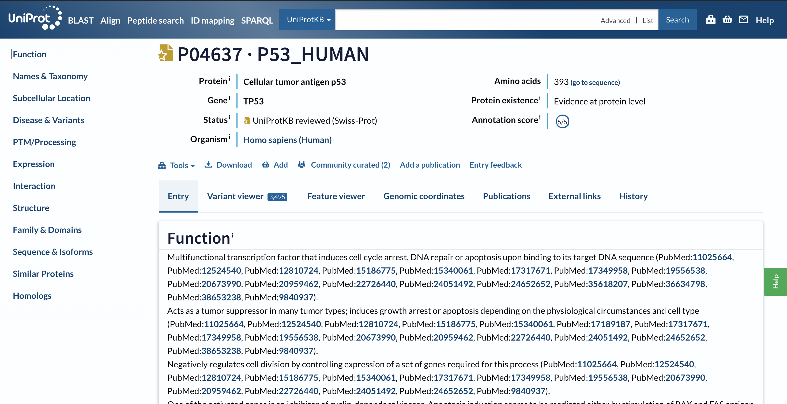
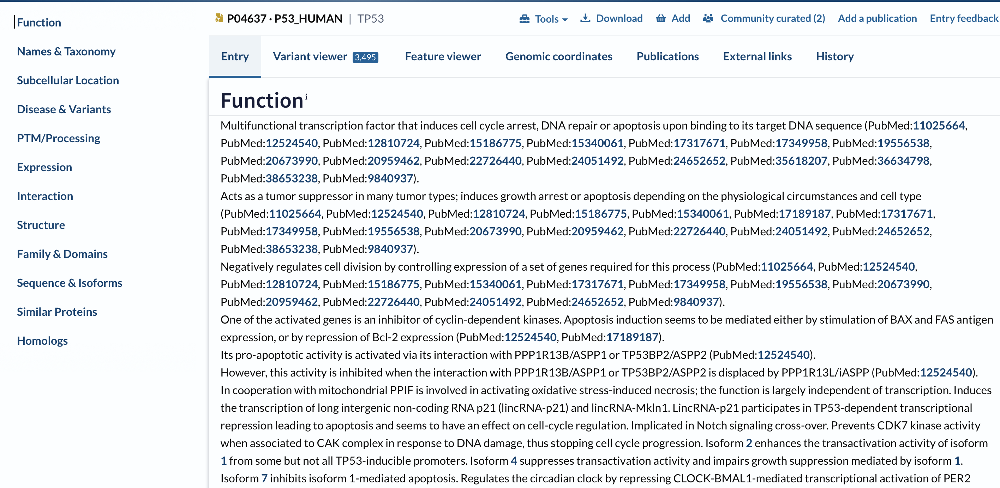
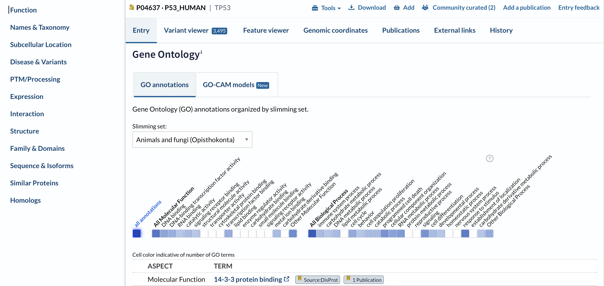
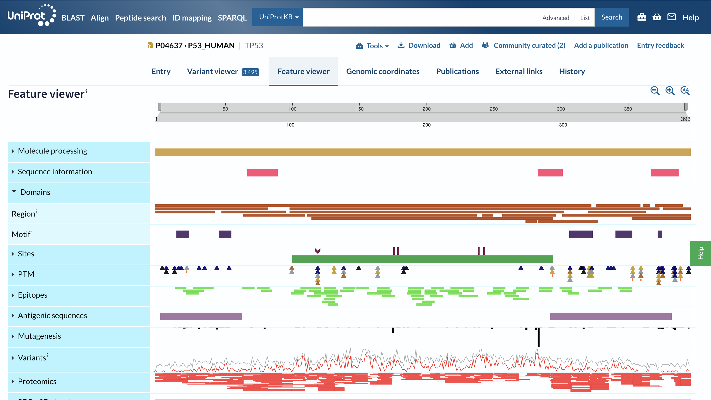
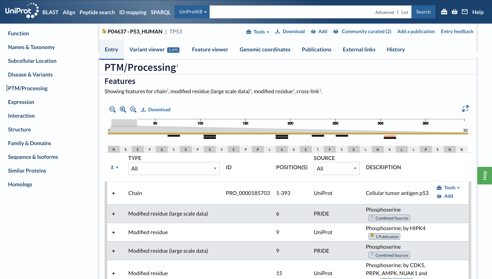
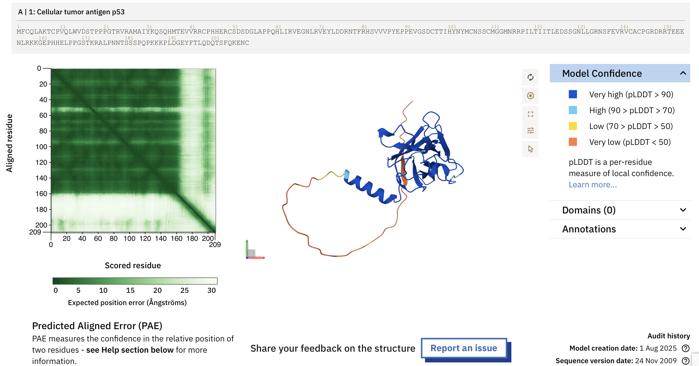
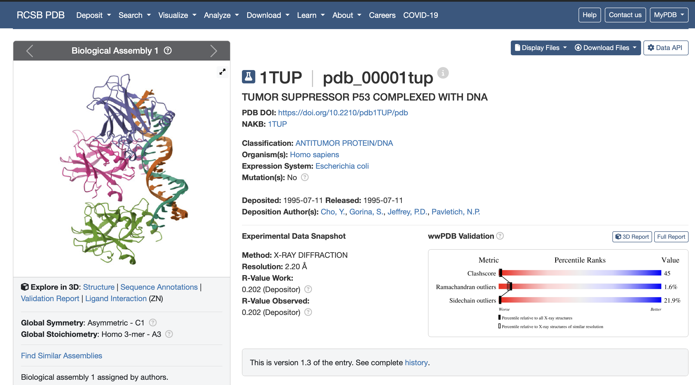
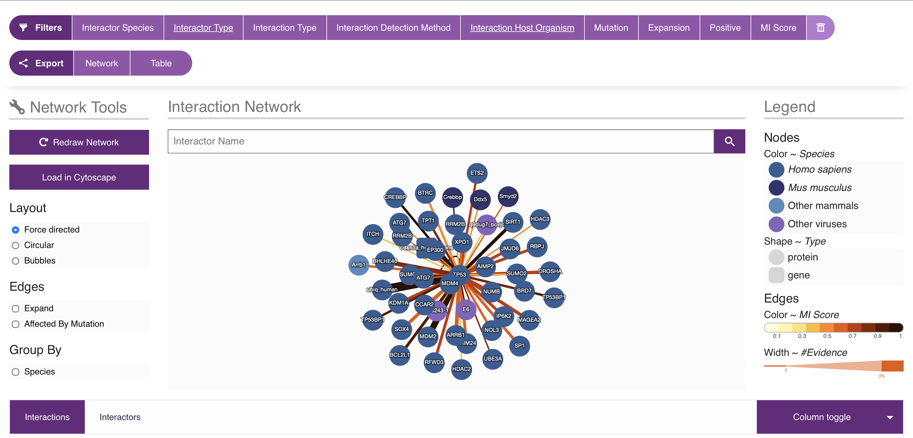
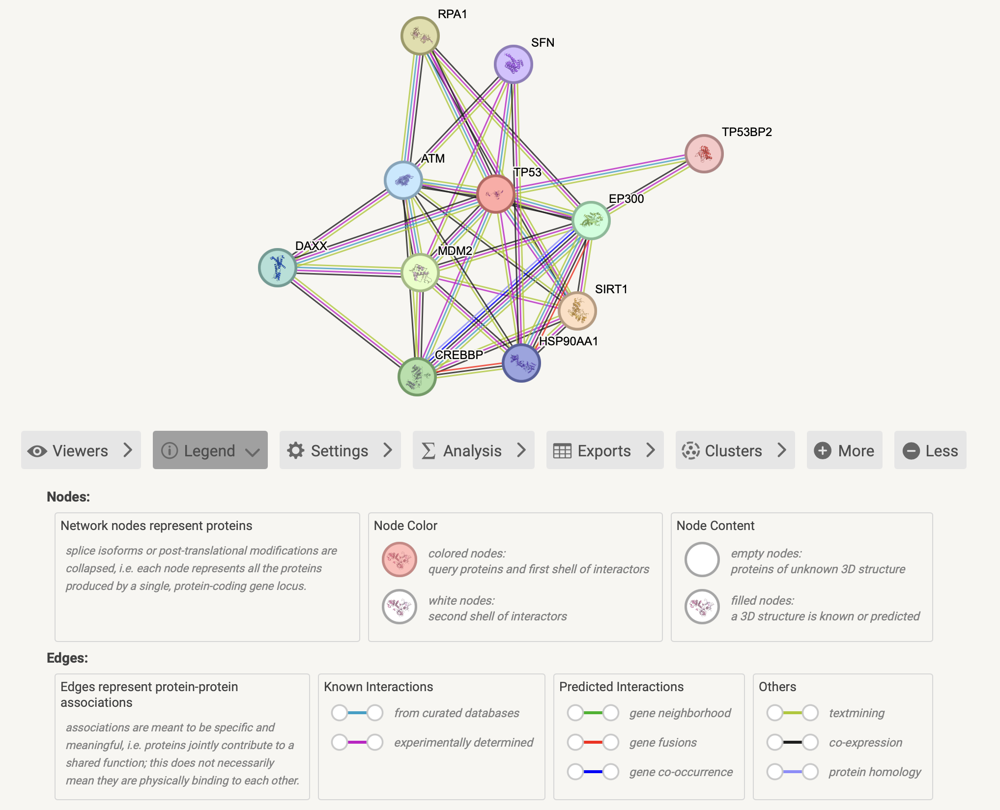

# 🧬 TP53 Protein Characterization Using Bioinformatics Databases

> A comprehensive bioinformatics case study of the human **TP53 (Tumor Protein p53)** using publicly available biological databases.


---

## 📖 Overview

This repository documents a comprehensive bioinformatics analysis of the human **TP53 (Tumor Protein p53)**. The project explores the protein's biological function, structural organization, post-translational modifications, interaction network, disease relevance, and associated biological pathways using widely adopted bioinformatics databases and resources.

The objective is to strengthen practical skills in protein annotation, structural biology, functional analysis, and scientific documentation while building a reproducible bioinformatics portfolio.

---

## 📑 Table of Contents

- [Objectives](#-objectives)
- [Databases Used](#-databases-used)
- [Project Workflow](#-project-workflow)
- [Protein Overview](#-protein-overview)
- [Biological Function](#-biological-function)
- [Protein Domains](#-protein-domains)
- [Post-Translational Modifications](#-post-translational-modifications)
- [Protein Structure](#-protein-structure)
- [Protein–Protein Interactions](#-proteinprotein-interactions)
- [Disease Associations](#-disease-associations)
- [Biological Pathways](#-biological-pathways)
- [Skills Demonstrated](#-skills-demonstrated)
- [Project Status](#-project-status)
- [References](#-references)

---

# 🎯 Objectives

- Characterize the human TP53 protein using bioinformatics databases.
- Study the structural and functional organization of TP53.
- Investigate protein domains and functional regions.
- Explore post-translational modifications (PTMs).
- Analyze protein structure using AlphaFold and the Protein Data Bank.
- Examine protein–protein interaction networks.
- Investigate disease associations.
- Explore biological pathways involving TP53.
- Develop scientific documentation using GitHub.

---

# 🛠️ Databases Used

| Database | Purpose |
|-----------|----------|
| UniProtKB | Protein annotation and functional information |
| AlphaFold Protein Structure Database | Predicted three-dimensional protein structure |
| Protein Data Bank (PDB) | Experimentally determined protein structures |
| IntAct | Protein–protein interaction analysis |
| Reactome | Biological pathway analysis |

---

# 🔬 Project Workflow

```text
UniProt
    │
    ▼
Protein Annotation
    │
    ▼
Protein Function
    │
    ▼
Functional Domains
    │
    ▼
Post-Translational Modifications
    │
    ▼
Protein Structure
    │
    ▼
Protein–Protein Interactions
    │
    ▼
Disease Associations
    │
    ▼
Reactome Pathway Analysis
    │
    ▼
Biological Interpretation
```

---

# 🧬 Protein Overview

## Protein Information

| Property | Value |
|----------|-------|
| Protein Name | Cellular tumor antigen p53 |
| Gene | TP53 |
| Organism | *Homo sapiens* |
| UniProt Accession | P04637 |
| Reviewed Status | Reviewed (Swiss-Prot) |
| Protein Length | 393 amino acids |
| Molecular Weight | 43,653 Da (≈43.7 kDa) |
| Subcellular Location | Nucleus |

### Overview

Tumor protein p53 (TP53) is a sequence-specific DNA-binding transcription factor that plays a central role in maintaining genomic stability. It responds to various forms of cellular stress, including DNA damage, oxidative stress, and oncogene activation, by regulating genes involved in cell cycle arrest, DNA repair, apoptosis, senescence, and metabolism.

Because TP53 prevents the accumulation of genetic mutations, it is widely known as the **"Guardian of the Genome."** Mutations in the TP53 gene are among the most common genetic alterations observed in human cancers, making it one of the most extensively studied proteins in molecular biology and cancer research.

## UniProt Entry



**Figure 1.** Overview of the reviewed human TP53 protein entry from UniProtKB (Accession: P04637), showing the protein name, gene, organism, reviewed status, and sequence length.

# 🧬 Biological Function

The **TP53** gene encodes the tumor suppressor protein **p53**, a sequence-specific DNA-binding transcription factor that plays a pivotal role in maintaining genomic integrity. Under normal physiological conditions, p53 is maintained at low intracellular levels through ubiquitin-mediated degradation by the E3 ubiquitin ligase **MDM2**. However, in response to cellular stress signals such as DNA damage, oxidative stress, hypoxia, or oncogene activation, p53 becomes stabilized and transcriptionally active.

Activated p53 regulates the expression of numerous downstream target genes involved in **cell cycle arrest**, **DNA repair**, **apoptosis**, **cellular senescence**, **metabolic regulation**, and **autophagy**. These coordinated cellular responses prevent the propagation of damaged DNA, thereby reducing genomic instability and suppressing tumor formation.

Because of its fundamental role in safeguarding the genome against mutations, p53 is widely recognized as the **"Guardian of the Genome."** Mutations in the TP53 gene are among the most frequently observed genetic alterations in human cancers, highlighting its importance in cancer biology and therapeutic research.

---

## Functional Annotation



**Figure 2.** Functional annotation of the reviewed human TP53 protein obtained from UniProtKB. The database describes TP53 as a multifunctional transcription factor involved in DNA damage response, cell cycle regulation, DNA repair, apoptosis, and tumor suppression.

### Interpretation

The UniProt functional annotation demonstrates that TP53 coordinates multiple cellular defense mechanisms following stress or DNA damage. By activating genes responsible for cell cycle arrest and DNA repair or initiating apoptosis when damage is irreversible, TP53 prevents the accumulation of harmful mutations and maintains genomic stability.

---

## Gene Ontology (GO) Analysis



**Figure 3.** Gene Ontology (GO) annotations of TP53 illustrating its molecular functions and participation in diverse biological processes.

### Interpretation

Gene Ontology analysis reveals that TP53 primarily functions as a **DNA-binding transcription factor** and participates in numerous biological processes, including **DNA damage response**, **regulation of transcription**, **cell cycle control**, **apoptosis**, and **cellular stress response**. These annotations collectively emphasize TP53's central role in regulating cellular homeostasis and preventing malignant transformation.

# 🧬 Protein Domains

The TP53 protein is composed of several conserved functional domains that collectively enable its role as a sequence-specific transcription factor and tumor suppressor. Each domain contributes to a distinct biological function, ranging from transcriptional activation to DNA recognition and protein oligomerization.

The N-terminal **Transactivation Domain (TAD)** recruits transcriptional co-activators and regulatory proteins such as MDM2, which controls p53 stability. The **Proline-Rich Region (PRR)** enhances apoptotic signaling and facilitates protein–protein interactions. The central **DNA-Binding Domain (DBD)** is responsible for recognizing specific DNA response elements and regulating the transcription of genes involved in cell cycle arrest, DNA repair, apoptosis, and senescence. This domain is highly conserved and contains the majority of pathogenic TP53 mutations identified in human cancers.

The **Tetramerization Domain (TD)** enables four p53 monomers to assemble into the biologically active tetramer required for efficient DNA binding. Finally, the **C-terminal Regulatory Domain (CTD)** modulates DNA-binding affinity and serves as a hotspot for numerous post-translational modifications that regulate protein activity.

## Functional Domains of TP53

| Domain | Amino Acid Position | Biological Role |
|---------|--------------------:|-----------------|
| Transactivation Domain (TAD) | 1–61 | Activates transcription and interacts with regulatory proteins |
| Proline-Rich Region (PRR) | 64–92 | Promotes apoptosis and protein–protein interactions |
| DNA-Binding Domain (DBD) | 94–292 | Sequence-specific DNA recognition and transcriptional regulation |
| Tetramerization Domain (TD) | 325–356 | Formation of the active p53 tetramer |
| C-terminal Regulatory Domain (CTD) | 363–393 | Regulation of DNA binding and post-translational modifications |

---

## UniProt Feature Viewer



**Figure 4.** UniProt Feature Viewer illustrating the structural organization of TP53, including conserved domains, functional regions, sequence motifs, modification sites, experimentally validated variants, and other annotated protein features.

### Interpretation

The UniProt Feature Viewer demonstrates that TP53 possesses a highly organized domain architecture with numerous experimentally annotated functional elements. The central DNA-binding domain represents the largest and most functionally important region of the protein, while the C-terminal region contains multiple regulatory motifs and post-translational modification sites. The high density of annotated variants within the DNA-binding domain reflects its critical role in maintaining TP53 function and explains why this region is frequently disrupted in human cancers.

# 🧬 Post-Translational Modifications (PTMs)

Post-translational modifications (PTMs) are reversible chemical changes that regulate TP53 activity after protein synthesis. Rather than remaining constantly active, TP53 is dynamically modified in response to cellular stress, allowing cells to rapidly control its stability, localization, protein interactions, and transcriptional activity.

DNA damage and other stress signals trigger multiple PTMs that activate TP53, whereas under normal physiological conditions TP53 is continuously ubiquitinated by **MDM2**, leading to proteasomal degradation. The balance between activating and inhibitory modifications determines whether TP53 induces DNA repair, cell cycle arrest, senescence, or apoptosis.

## Major Post-Translational Modifications

| Modification | Function |
|--------------|----------|
| **Phosphorylation** | Stabilizes TP53 following DNA damage and promotes its activation. |
| **Acetylation** | Enhances DNA-binding affinity and increases transcriptional activity. |
| **Ubiquitination** | Mediated primarily by MDM2 and targets TP53 for proteasomal degradation. |
| **Methylation** | Regulates transcriptional activity and protein interactions. |
| **Sumoylation** | Influences nuclear localization and transcriptional regulation. |
| **Neddylation** | Modulates TP53 stability and functional activity under specific cellular conditions. |

---

## UniProt PTM Annotation



**Figure 5.** UniProtKB PTM/Processing annotation of TP53 showing experimentally validated modification sites, processed chain information, and post-translational modifications reported from curated literature and large-scale proteomics studies.

### Interpretation

The PTM annotation demonstrates that TP53 is one of the most extensively regulated proteins in human cells. Numerous phosphorylation sites are concentrated within the N-terminal region, where they stabilize TP53 and prevent degradation by MDM2 following DNA damage. Additional modifications distributed throughout the protein fine-tune DNA binding, transcriptional activity, intracellular localization, and protein stability. Collectively, these modifications enable TP53 to function as a rapid and tightly controlled cellular stress sensor.

# 🧬 Protein Structure

The three-dimensional structure of TP53 is essential for its function as a tumor suppressor and sequence-specific DNA-binding transcription factor. Structurally, TP53 consists of both ordered and intrinsically disordered regions that enable DNA recognition, transcriptional regulation, and interactions with numerous cellular proteins.

Structural information for TP53 is available through computational prediction using **AlphaFold** and experimentally determined structures deposited in the **Protein Data Bank (PDB)**. Together, these complementary resources provide a comprehensive understanding of the protein's architecture and function.

---

## AlphaFold Predicted Structure



**Figure 6.** Predicted three-dimensional structure of the human TP53 protein generated by AlphaFold. The structure is coloured according to the predicted Local Distance Difference Test (pLDDT) confidence score, where blue indicates high confidence and orange/red represents intrinsically disordered or flexible regions.

### Interpretation

The AlphaFold model predicts a highly structured central DNA-binding domain with high confidence, whereas the N-terminal transactivation domain and C-terminal regulatory domain exhibit lower confidence scores. These flexible regions are known to participate in regulatory protein interactions and undergo numerous post-translational modifications that control TP53 activity.

---

## Experimental Structure (Protein Data Bank)



**Figure 7.** Crystal structure of the TP53 DNA-binding domain in complex with DNA (PDB ID: **1TUP**) determined by X-ray crystallography at 2.20 Å resolution.

### Interpretation

The experimentally determined structure illustrates how TP53 directly recognizes and binds DNA through its conserved DNA-binding domain. This interaction enables TP53 to regulate the transcription of genes involved in DNA repair, cell cycle arrest, apoptosis, and senescence. The DNA-binding domain is also the region in which most pathogenic TP53 mutations occur, making it a critical focus of cancer research.

---

## AlphaFold vs Protein Data Bank

| Feature | AlphaFold | Protein Data Bank (PDB) |
|---------|-----------|--------------------------|
| Structure Type | Computational prediction | Experimentally determined |
| Coverage | Nearly full-length protein | Individual domains or complexes |
| Method | Artificial Intelligence | X-ray crystallography, Cryo-EM, NMR |
| Primary Advantage | Complete structural model | Atomic-level experimental validation |

### Summary

The AlphaFold model provides a complete structural prediction of TP53, while experimentally determined PDB structures validate the organization of key functional domains at atomic resolution. Using both resources together provides a more comprehensive understanding of TP53 structure, function, and the molecular basis of disease-associated mutations.

# 🧬 Protein–Protein Interactions

TP53 functions as the central hub of a complex protein interaction network that coordinates the cellular response to DNA damage and other forms of stress. Rather than acting independently, TP53 interacts with numerous regulatory proteins that control its activation, stability, degradation, and transcriptional activity. These interactions determine whether a damaged cell undergoes DNA repair, transient cell cycle arrest, senescence, or apoptosis.

Multiple experimental studies have demonstrated that TP53 activity is tightly regulated by proteins involved in phosphorylation, acetylation, ubiquitination, chromatin remodeling, and DNA damage signaling.

## Major TP53 Interacting Proteins

| Protein | Function | Relationship with TP53 |
|---------|----------|-------------------------|
| **MDM2** | E3 ubiquitin ligase | Promotes TP53 ubiquitination and degradation. |
| **ATM** | DNA damage kinase | Activates TP53 through phosphorylation. |
| **EP300** | Histone acetyltransferase | Acetylates TP53 and enhances transcription. |
| **CREBBP** | Transcriptional co-activator | Works together with TP53 to regulate gene expression. |
| **SIRT1** | Protein deacetylase | Decreases TP53 transcriptional activity through deacetylation. |
| **TP53BP1** | DNA damage response protein | Participates in DNA repair signaling alongside TP53. |

---

## Experimentally Validated Interaction Network (IntAct)



**Figure 8.** Experimentally validated TP53 interaction network obtained from the IntAct database. Nodes represent interacting proteins, while edges represent curated molecular interactions supported by experimental evidence.

### Interpretation

The IntAct interaction network demonstrates that TP53 acts as a highly connected molecular hub interacting with proteins involved in DNA damage signaling, transcriptional regulation, chromatin remodeling, ubiquitination, and apoptosis. The large number of experimentally validated interactions highlights the central regulatory role of TP53 in maintaining genomic stability.

---

## Functional Interaction Network (STRING)



**Figure 9.** Functional protein association network of TP53 generated using the STRING database.

### Interpretation

The STRING network complements the experimentally validated IntAct data by integrating functional associations derived from curated databases, experimental studies, computational prediction, co-expression analysis, and text mining. The dense interaction network illustrates that TP53 participates in numerous interconnected biological pathways rather than functioning as an isolated transcription factor.

---

## Comparison of Interaction Databases

| Feature | IntAct | STRING |
|----------|--------|---------|
| Primary Data | Experimentally validated molecular interactions | Functional protein associations |
| Evidence | Curated literature | Experimental + computational + literature |
| Best Use | Validation of physical interactions | Network visualization and pathway analysis |

### Summary

Using both IntAct and STRING provides complementary perspectives on TP53 biology. IntAct offers high-confidence experimentally validated interactions, whereas STRING expands these interactions into a broader functional network. Together, these resources demonstrate that TP53 serves as a master regulator connecting DNA repair, cell cycle regulation, apoptosis, chromatin remodeling, and cellular stress response pathways.

# 🧬 Disease Associations

---

# 🧬 Biological Pathways

---

# 🎓 Skills Demonstrated

- Protein annotation
- Protein sequence interpretation
- Functional domain analysis
- Protein structure interpretation
- Post-translational modification analysis
- Protein interaction analysis
- Biological pathway analysis
- Scientific literature interpretation
- Technical documentation using Markdown
- GitHub project documentation

---

# 📊 Project Status

| Task | Status |
|------|--------|
| Repository Setup | ✅ Completed |
| Literature Review | 🔄 Ongoing |
| Protein Characterization | 🔄 Ongoing |
| Documentation | 🔄 Ongoing |

---

# 📚 References

A complete list of references and biological databases used throughout this project is available in:

**`references/references.md`**

---

## 👩‍💻 Author

**Nidhi Shah**
Interested in Bioinformatics, Computational Biology, Cancer Genomics and Omics Data Analysis.
